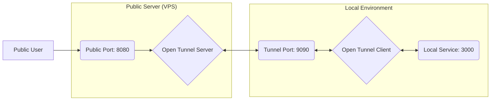

# 🚀 Open Tunnel

**A Powerful, Open-Source Gateway for Secure Public Access to Local Services.**

[](https://github.com/ishandutta2007/open-tunneling/stargazers)
[](https://github.com/ishandutta2007/open-tunneling/network)
[](https://github.com/ishandutta2007/open-tunneling/issues)
[](https://github.com/ishandutta2007/open-tunneling/blob/main/LICENSE)
[](https://GitHub.com/ishandutta2007/open-tunneling/graphs/commit-activity)
[](http://makeapullrequest.com)
<a href="https://github.com/ishandutta2007">
  
</a>

---

**Open Tunnel** is a free and open-source alternative to services like **ngrok**, **Cloudflare Tunnel**, and **Tailscale**. It allows you to expose your local development environment to the public internet securely and efficiently. Whether you're testing webhooks, sharing a demo, or hosting a temporary service, Open Tunnel has you covered.

## 📖 Table of Contents

- [✨ Features](#-features)
- [🛠️ Tech Stack](#️-tech-stack)
- [⚙️ How It Works](#️-how-it-works)
- [🚀 Getting Started](#-getting-started)
  - [Prerequisites](#prerequisites)
  - [Installation](#installation)
  - [Usage](#usage)
- [🤝 Contributing](#-contributing)
- [💬 Community & Support](#-community--support)
- [💖 Support & Sponsorship](#-support--sponsorship)
- [🛡️ Security](#️-security)
- [📄 License](#-license)

---

## ✨ Features

- 🔒 **Secure Tunneling:** Create encrypted channels between your local machine and the public internet.
- 🏠 **Self-Hostable:** Run the server component on your own infrastructure for maximum privacy.
- ⚡ **Lightweight:** Built with performance in mind using Node.js and TypeScript.
- 🌐 **HTTP & TCP Support:** Forward any traffic, from simple web servers to complex SSH connections.
- 🛠️ **Developer Friendly:** Simple CLI-like interface for easy integration into your workflow.

## 🛠️ Tech Stack

- **Language:** [TypeScript](https://www.typescriptlang.org/)
- **Runtime:** [Node.js](https://nodejs.org/)
- **Networking:** Native `net` module for high-performance TCP socket management.

## ⚙️ How It Works

The architecture involves two primary components: the **Server** and the **Client**.



1.  **Server:** Runs on a machine with a static public IP. It listens for incoming public requests and client tunnel connections.
2.  **Client:** Runs locally, connects to the server, and bridges the gap to your local service.

---

## 🚀 Getting Started

### Prerequisites

- **Node.js** (v18 or higher recommended)
- **npm** or **yarn**
- A server with a public IP (for production use)

### Installation

Clone the repository and install the dependencies:

```bash
git clone https://github.com/ishandutta2007/open-tunneling.git
cd open-tunneling
npm install
```

### Usage

#### 1. Start the Server
Deploy this on your public server:
```bash
npm run start:server
```

#### 2. Start the Client
Run this on your local machine:
```bash
npm run start:client
```

*Note: Edit `src/client.ts` to point `SERVER_HOST` to your server's IP address.*

---

## 🤝 Contributing

Contributions are what make the open-source community such an amazing place to learn, inspire, and create. Any contributions you make are **greatly appreciated**.

1. Fork the Project
2. Create your Feature Branch (`git checkout -b feature/AmazingFeature`)
3. Commit your Changes (`git commit -m 'Add some AmazingFeature'`)
4. Push to the Branch (`git push origin feature/AmazingFeature`)
5. Open a Pull Request

### ✨ Star History

[](https://www.star-history.com/#ishandutta2007/open-tunneling&type=date&legend=top-left)

### 💬 Community & Support

-   **🗣️ [Forum](https://community.open-workflows.com):** Join our community forum to ask questions and share projects.
-   **💬 [Discord](https://discord.com/invite/jc4xtF58Ve):** Chat with us on Discord for real-time support.
-   **🐦 [Twitter](https://twitter.com/ishandutta2007):** Follow us on Twitter for the latest news.
-   **🐙 [Github](https://github.com/ishandutta2007):** Follow for the latest commits and updates.

## 💖 Support & Sponsorship

If you find this project helpful, please consider sponsoring the development. Your support helps maintain the project and develop new features.

**[Sponsor @ishandutta2007 on GitHub](https://github.com/sponsors/ishandutta2007)**

## 🛡️ Security

Security is a top priority. Please report security vulnerabilities via email to [security@yourdomain.com](mailto:security@yourdomain.com).

## 📄 License

Distributed under the MIT License. See `LICENSE` for more information.

---

<p align="center">
  Made with ❤️ by <a href="https://github.com/ishandutta2007">Ishan Dutta</a>
</p>
